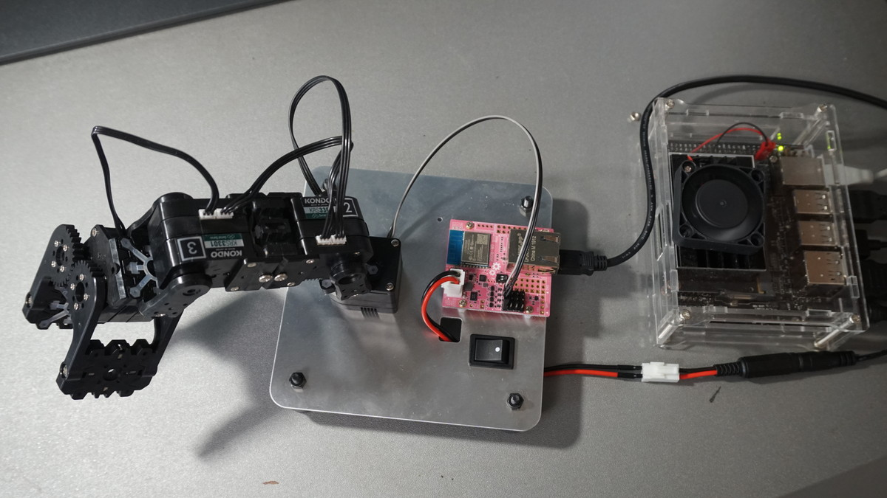

# GR-ROSE ROS通信用ソース

- 近藤科学KXR-A3Sに付属のGR-ROSE用ソースです
- ROS1対応
- rosserialでJetson Nanoと通信させています



## ICSManager.ino

- 近藤科学公式より提供されているICSManger用ソースです
- 各サーボをデスクトップアプリから操作できます
- サーボID書き換え時は単体で接続してください

[ICS3.5/3.6 Manager software R1.1.0.0(2020/10/10現在)](https://kondo-robot.com/faq/ics35mag_soft1100)


## OneAxisTest.ino

- サーボ1軸目のみランダムに回転させます

## ThreeAxisTest.ino

- サーボ3軸をランダムに回転させます

## FourAxisTest.ino

- サーボ4軸をランダムに回転させます
- グリッパ取り付け後のテストに使用

## LedAndSerialTest.ino

- PIN_LED1のブリンクと5Hz周期でシリアル送信を行います
- IDEのシリアルモニターで送られてきた文字列を確認できます

## pubsub.ino
GR-ROSEのノードでPubSubをテストできます

### Pub:
2Hz周期で/chatterに"hello world!"を配信します

例）配信トピックの購読コマンド
```
rostopic echo /chatter
```

### Sub:
購読するとPIN_LED1を点滅させます

例）2Hz周期でPIN_LED1をブリンクさせるコマンド
```
rostopic pub /toggle_led std_msgs/Empty -r 2'
```

